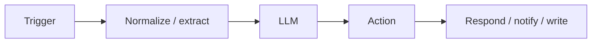

# Architecture

Short map of how each starter workflow moves data. Pattern is always **trigger → LLM → action**.

## Per workflow

```mermaid
flowchart TB
  subgraph w01["01 Email triage"]
    A1[Webhook email stub] --> A2[Set fields]
    A2 --> A3[OpenAI classify JSON]
    A3 --> A4[Switch route]
    A4 --> A5[Label + Respond]
  end

  subgraph w02["02 PDF summary"]
    B1[Form upload] --> B2[Extract PDF text]
    B2 --> B3[HTTP chat completions]
    B3 --> B4[Markdown Set]
  end

  subgraph w03["03 Webhook to Slack"]
    C1[HTTP Webhook] --> C2[OpenAI format]
    C2 --> C3[Slack post]
    C3 --> C4[Respond JSON]
  end

  subgraph w04["04 RSS digest"]
    D1[Schedule] --> D2[RSS + limit + aggregate]
    D2 --> D3[OpenAI digest]
    D3 --> D4[Email / optional Slack]
  end

  subgraph w05["05 Form to CRM"]
    E1[Form] --> E2[OpenAI normalize]
    E2 --> E3[HTTP CRM stub]
    E3 --> E4[Confirm]
  end
```

## Design choices

| Choice | Rationale |
| --- | --- |
| Webhook stubs for email | Importable without IMAP secrets; swap to Email Trigger later |
| OpenAI node + HTTP Request | Shows native credential UX and vendor-agnostic Completions |
| httpbin CRM target | Safe public echo; no fake customer PII required |
| Sticky notes on canvas | Setup path visible inside n8n, not only in README |
| `active: false` in exports | Prevents accidental live webhooks on import |

## n8n version assumptions

- Export shape: UI **Import from File** object (`name`, `nodes`, `connections`, `settings.executionOrder: v1`).
- OpenAI Chat: `@n8n/n8n-nodes-langchain.openAi` **typeVersion 1.8** (Message / text).
- Common core nodes: Webhook 2.1, Form Trigger 2.2, HTTP Request 4.2, Slack 2.2, Schedule 1.2, Switch 3.2, Set 3.4.
- Target runtime: **n8n 1.x ≥ 1.70** (Cloud or self-hosted).
